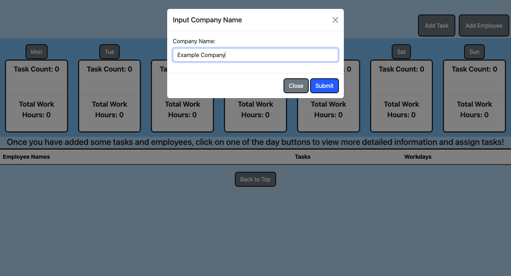
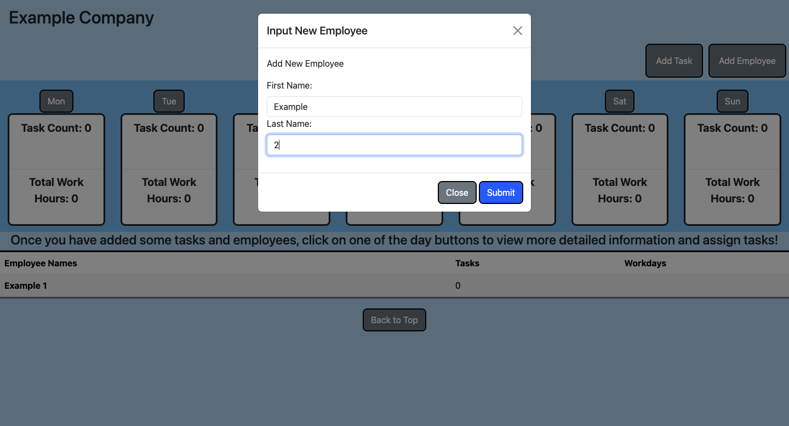

# Management Calendar
### KU Full Stack Bootcamp Project 1 Group 2

## Description

This calendar is a webpage designed to help project managers organize and oversee their projects on a weekly basis. It provides a clear overview of tasks and who should be working on them, making it easier to assign tasks to team members and monitor their progress. This calendar is suited for project managers who need to keep track of a variety of tasks and teams and ensure they stay on schedule. It is a simple tool you plan your week effectively and store a persisting record of what you aim to accomplish and who is helping you make it happen.

## How to Access

Since our project is a web application, you only need to visit [the webpage](https://fluviangumbo.github.io/Management-Calendar/) to get started!

## Usage

The user will go to the webpage and the calendar will load all previously input data from local storage. If no prior data exists, then the application will prompt the user to enter a company name before the calendar will display an empty view of the week. Each day will link to a separate page that is a spotlight of the tasks that are set for that day and the employees set to work on them. At the bottom of the main page is a table that shows all of the employees you have added and their workloads.

#### Here is the page before any data is displayed:

#### Here is an example after some data has been input:

#### This is the prompt to enter a company name:

#### New Data
You can add new employees and tasks at any time, but please make sure that you follow the instructions when inputting your data. There are two buttons at the top right of the screen that will open these inputs.

#### Task:

#### Employee:

#### Day Page
Clicking on one of the buttons above a day on the main page will take you to a breakdown for that specific day of the week and provide you with more information. You will see a display of both the tasks that are set for the day and a list of all employees who are assigned to one of the day's tasks.

 
#### Assigning Tasks
This is also where you can link employees to tasks using the button at the top of the day page.

Please refer any suggestions to improve the site to the email address listed in the contact section below!

## Credits

Developers:
    - Joseph Eyler
    - Nimai Macmillan
    - Tony Phan
    - Joel Roney

## License

This project is licensed under the MIT License. See the LICENSE file for details.

## Contact

You can reach out to jroney002@gmail.com with any questions!